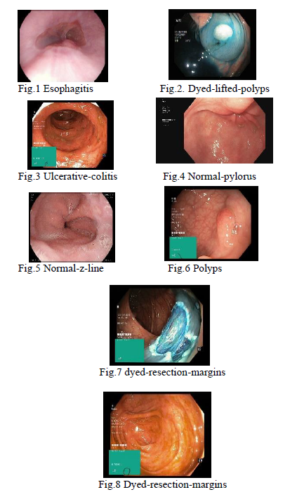
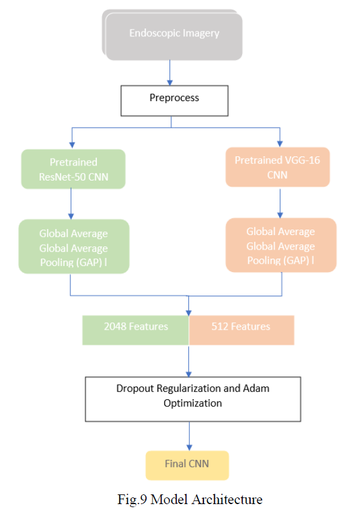
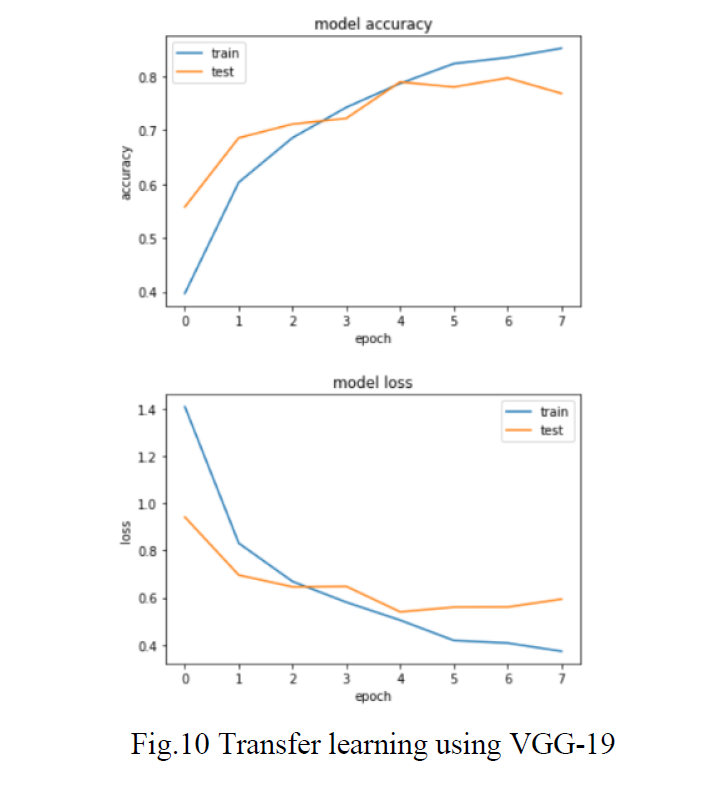
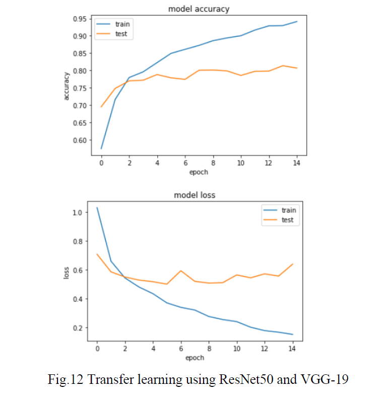

# Classification-of-Anomalies-in-Gastrointestinal-Tract-through-Endoscopic-Imagery-with-Deep-Learning

## Table of contents
* [INTRODUCTION](#introduction)
* [LITERATURE REVIEW](#literature-review)
  * Input Dataset
  * Methods / Workflows
  * Theories / Technologies
* [METHODOLOGY](#methodology)
  * Approach
  * Preprocessing
* [CLASSIFICATION EXPERIMENTS AND DISCUSSION OF RESULTS](#classification-experiments-and-discussion-of-results)
* [CONCLUSIONS](#conclusions)
* [REFERENCES](#references)
  
## INTRODUCTION

The gastrointestinal tract is one of the most crucial organs in the human body. Same as the other organs in human body, gastrointestinal tract can be infected by several diseases. Among those diseases, gastrointestinal cancers are known to be the most threatening as claimed by reports from many organizations. Colorectal cancer which is a GI cancer, is identified as the responsible disease to 10% of reported cancers [1]. Furthermore, about 1.8 million deaths per year are reported due to gastrointestinal diseases [2].

As for other cancers, most efficient and safest way to deal with gastrointestinal cancers is accurate identification of the cancer when cancer is in its early stage. Although, accurate disease identification is not only crucial for cancers. Many techniques are used to identify gastrointestinal diseases today. One of the most accurate method from those is imaging techniques. Endoscopy imaging is a leading imaging technique to identify gastrointestinal diseases.

A tiny camera attached to a flexible tube is utilized to apply imaging techniques in endoscopy imaging. An output image is shown on a connected monitor real-time. In normal endoscopy imaging, the output image is observed by a well experienced gastroenterologist and decide the anomaly type. Although it’s done by a specialist, keeping responsibility of a critical decision like disease identification to human can be a huge risk. So, nowadays, automated intelligent computer systems are operated as accurate disease identifier.

Deep-learning based techniques have become notable technique to resolve this gastrointestinal medical imaging issue with accurate disease identification. In this study, convolutional neural network models are trained using the relatively small KVASIR dataset. The KVASIR dataset consists of 4, 000 images, which were collected using standard endoscopy equipment from Olympus and Pentax the Department of Gastroenterology, Bairam Hospital, Vestre, Viken Hospital Trust, Norway. These images were annotated and verified by medical doctors including eight classes showing anatomical landmarks, pathological findings, or endoscopic procedures in the GI tract. The anatomical landmarks include Z-line, pylorus, and cecum, and pathological findings consist of esophagitis, polyps, and ulcerative colitis. Addition to these 6 classes dataset provides another two set of images related to removal of polyps ‘dyed and lifted polyp" and the "dyed resection margins". The dataset includes images of different resolutions from 720x576 up to 1920x1072 pixels and sorted in a manner where they are in separate folders named accordingly to the includes. In this, we try to train a model using the labeled samples of these images and tried to predict the class names of the unlabeled samples.

A pre trained Convolutional Neural Network has been used to implement the desired system. Two pre trained models has been used to achieve the desired solution.

## LITERATURE REVIEW

Related works to the desired system can be analyzed in many perspectives. Divisions like input dataset, theories and methodologies will be used to review related literature resources in this section.

### Input Dataset

In [3], an extensive image set was used by the related researches. The researchers in [4] used a relatively small but easily accessible dataset for public which is known as KVASIR. Also, the researchers of [5] were used a large number of colonoscopic images for their researches.

While research method in [5] achieved a very high rate of accuracy (99.42%) and precision rate (99.51%), the highest accuracy level (98.48%) which could be achieved by the research in [4] is little bit lower than the research [5].

As expected, accuracy [5] and [4] are higher than [3]. Although, it’s obvious accuracy and succession of the model is highly dependent on the using dataset, we decided to use KVASIR dataset same as research team in [3] because it is recommended by the instructor and KVASIR is easily accessible and open dataset for public.

### Methods / Workflows

A cross dataset is used in research [3]. So, the research is done using the knowledge on cross dataset evaluation and evaluation metrics. Machine leaning has been played a huge role in this research.

In research [3], image pre-processing techniques were used by the researchers. The aim of performing image pre-processing is to improve the image data that suppresses unwanted distortions and enhance image features for further processing. State to develop the relevant model.

A hybrid neural network model which is called SOM and BP are used in research [5].

A Conventional neural network is used in our desired system because it is recommended by the instructor and also, it’s beginner friendly.

### Theories / Technologies
Research [3] has been performed using unbiased extensive cross dataset. In this work they said without these conditions automatic analysis is incomplete. Because of using cross dataset, evaluation metrics and machine learning plays a huge role in this research. They built five distinct machine learning models using global features and deep neural networks. 16 different key types can be classified using the models. Furthermore, they introduced

performance hexagon using six performance metrics such as,
• Recall
• Precision
• pecificity
• Accuracy
• F1-score

The researchers of this research have concluded that, these models have high accuracy rate due to workflow they used. The researchers’ main conclusion and resulting recommendation is that a multi-center or cross-dataset evaluation is important if not essential for ML models in the medical field to obtain a realistic understanding of the performance of such models in real world settings.

In research [4], as researchers mentioned their main concern is not to using a large dataset. KVASIR open dataset is used in this research. The research was done by performing robust image pre-processing and applying state of art deep learning. Images are classified as anatomical landmark, diseased state, or a medical procedure.
When directing the research, three state-of-the-art neural networks architectures, Inception-ResNet-v2, Inception-v4, and NASNet, are trained on the KVASIR dataset.

The research [5] work is based on the classification of endoscopic images based on texture and neural network. Textures which were changed due to a disease is used to classify the endoscopic images. Local Binary Pattern and log-likelihood-ratio was used to implement the model. Hybrid neural network which is known as SOM and BP are applied to the research.

This is done by using large number of colonoscopy images. It is mentioned that unsupervised endoscopic image classification is applicable in the above way.

## METHODOLOGY

### Approach
We used pre-trained CNN for transfer learning to extract important features because this is relatively small dataset (only 8000 images). The pretrained models that we used in this approach are ResNet-50 and VGG-19. The proposed approach of anomalies classification is based on the steps as described below. First, we preprocessed the dataset due to some reasons as described in IV-B. Then we used pretrained CNNs and added global average pooling (GAP) layer to both and then combined the extracted features as shown in Fig. 9 (2048 from ResNet50 and 512 from VGG19).

After we added more dense layers and dropout regularization (dropout value as 0.5) to reduce overfitting and finally added SoftMax layer to identify the most matching category of an image. This model was trained with Adam optimization and we used mini batch size as 64 for this CNN. We used popular categorical cross-entropy loss function as the loss function of this mode. After 15 epochs, about 4 hours of training, our CNN achieved over 94% accuracy on train dataset and over 80% accuracy on test dataset.

### Preprocessing

We resized each image in KVASIR dataset into 244 x 244 pixels because of three reasons, KVASIR dataset contains different size of images, Small size of images get small time to learn relative to large images and 224 x 224 shape images perform well on the models that we used to transfer learning. Sometimes we used to 96 x 96 as well because we did not have good GPUs, so we need faster learning.

## CLASSIFICATION EXPERIMENTS AND DISCUSSION OF RESULTS

We experiment different approaches to use transfer learning by using pretrained CNNs (ResNet-50, VGG-19) individually and in pairs. We untrained some variables in some layers of these CNNs to reduce training time. After training and testing on each approach we added GAP layer to feature extraction and batch normalization and dropout regularization to provide relatively higher learning rate and to reduce the variance problem according to the train and test accuracy.

We used accuracy as key evaluation metric to evaluate the performance of our final CNN models. Accuracy evaluation metric calculates how often predictions equal labels.

There are three approaches that we used to classify images.

First, we used transfer learning using pretrained VGG-19 CNN. For this CNN we preprocessed data into size of 96 x 96 pixels to reduce the training time and then added global average pooling layer and some dense layers with dropout layers to provide regularization. Finally, we added SoftMax layer. We used Adam optimizer and categorical cross-entropy loss function for all these approaches. This CNN achieved over 76% accuracy on test dataset.

Then we used transfer learning using pretrained RetNet-50 dataset. For this CNN we preprocessed data into 224 x 224 pixels and added global average pooling layer and dense layer with dropout layer. Using this CNN, we could not get good accuracy because that needs very long training. For that may affect the number of layers that we did not train the variables, preprocessing size, we used that size (224 x 224) because some resources provide ResNet-50 expects to have that shape and our overall CNN architecture.

We got our best accuracy using ResNet-50 and VGG-19 followed by global average pooling layer to extract features from these models as described in the IV methodology. Using this CNN, we achieved over 94% accuracy on the train set and over 80% accuracy on the test set and over 80% accuracy on the validation and test dataset. We experiment the train and test accuracy by changing the number of layers that we did not train the variables, adding regularization (dropout regularization) to reduce this overfitting.

## CONCLUSIONS

Pre-trained models (ResNet-50 and VGG-19) followed by global average pooling layer can be used to feature extraction from these models and we used preprocessed images from GI dataset to reduce learning time. And also, Adam optimization and categorical cross-entropy loss function are used. The proposed CNN approach shows over 80% accuracy.

## REFERENCES

[1] M. Ervik, F. Lam, J. Ferlay, L. Mery, I. Soerjomataram, F. Bray et al., “Cancer today. lyon, france: International agency for research on cancer,”Cancer Today, vol. 3, pp. 235–248, 2016.

[2] Latest global cancer data. [Online]. Available: https://www.iarc.fr/wpcontent/uploads/2018/09/pr263_E.pdf

[3] An Extensive Study on Cross-Dataset Bias and Evaluation Metrics Interpretation for Machine Learning applied to Gastrointestinal Tract Abnormality Classification,Vajira Thambawita, Debesh Jha, Hugo Lewi Hammer, Håvard D. Johansen, Dag Johansen, Pål Halvorsen, Michael A. Riegler

[4] Timothy Cogan, Maribeth Cogan, Lakshman Tamil,
MAPGI: Accurate identification of anatomical landmarks and diseased tissue in gastrointestinal tract using deep learning, Computers in Biology and Medicine, Volume 111, 2019, 103351, ISSN 0010-4825, https://doi.org/10.1016/j.compbiomed.2019.103351.
(http://www.sciencedirect.com/science/article/pii/S0010482519302288)

[5] Muhammad Sharif, Muhammad Attique Khan, Muhammad Rashid, Mussarat Yasmin, Farhat Afza & Urcun John Tanik (2019) Deep CNN and geometric features-based gastrointestinal tract diseases detection and classification from wireless capsule endoscopy images, Journal of Experimental & Theoretical Artificial Intelligence, DOI: 10.1080/0952813X.2019.1572657

